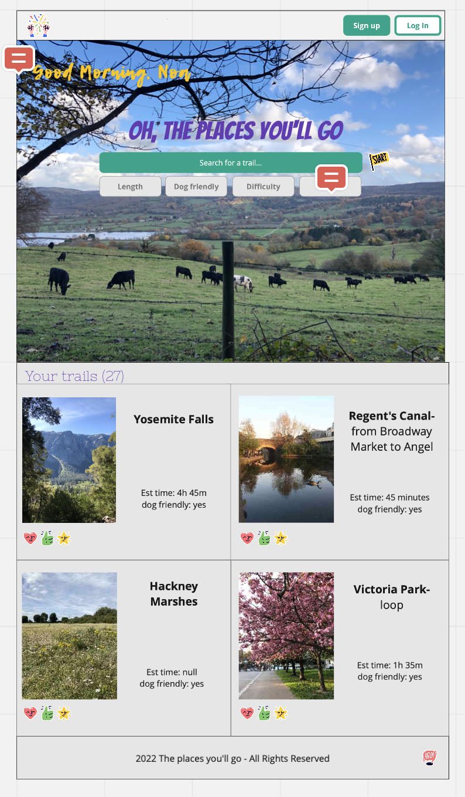
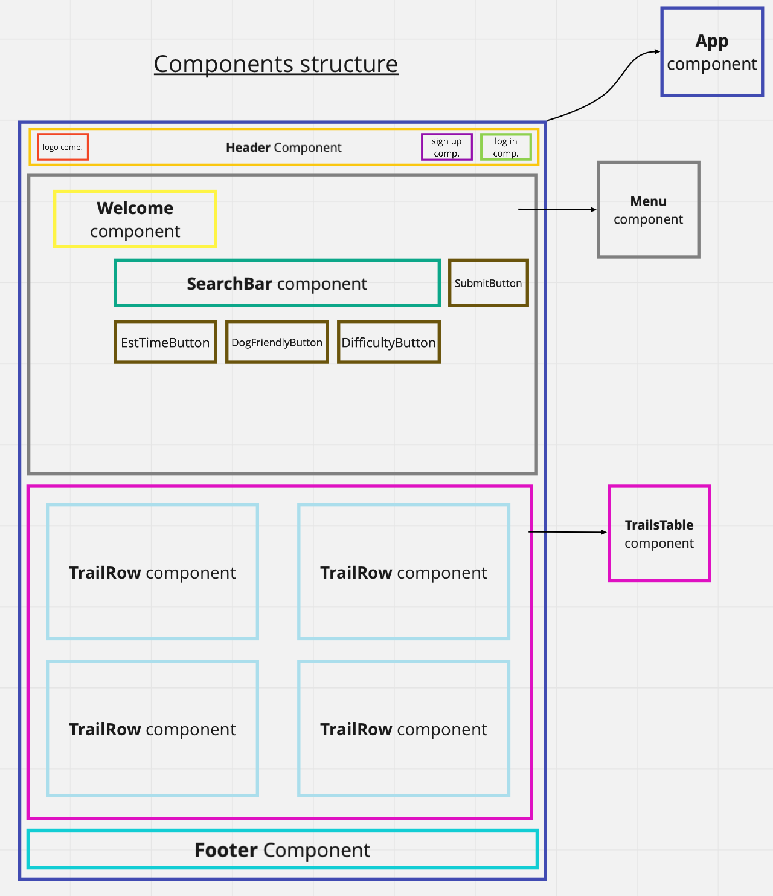

# Hiking App

## About

## Project Status
This project is currently in development.

## Installation and Setup Instructions

## Design and Approach




### Project Management
- [Trello board](https://trello.com/b/ClZSDPID/hikes-app)
- [Miro board](https://miro.com/app/board/uXjVO3w6Di8=/)

### User Stories

```
As a user
So that I can casually browse through some trails
I want to be able to see a list of all of the trails
```

```
As a user
So that I can find a relevant trail for my upcoming trip
I want to be able to search for a trail by its location
```

```
As a user
So that I can plan my trip's schedule
I want to be able to filter trails by estimated time
```

```
As a user
So that I can go for a hike with my dog
I want to be able to filter trails by dog-friendly-ness
```

```
As a user
So that I can make sure the hike matches my energy levels
I want to be able to filter by difficulty
```

```
As a user
So that I can have an account
I want to be able to sign up 
```

```
As a user
So that I can save trails to my favourites and my wishlist
I want to be able to log in
```